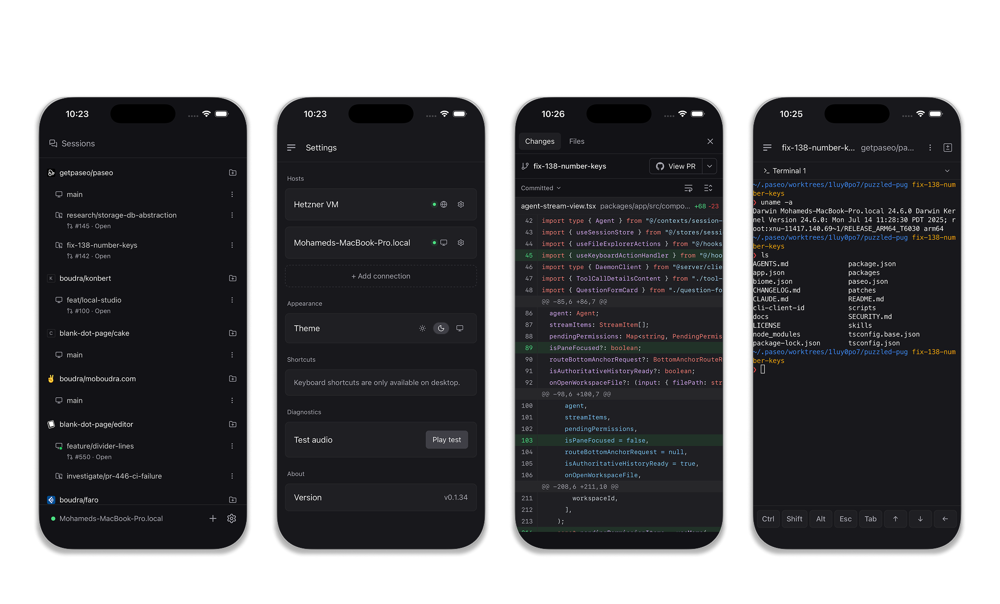

<p align="center">
  
</p>

<h1 align="center">BySpace</h1>

<p align="center">
  <a href="README.md">English</a> ·
  <a href="README.zh-CN.md">简体中文</a> ·
  <a href="README.ja.md">日本語</a> ·
  <a href="README.ko.md">한국어</a>
</p>

<p align="center">
  <a href="https://github.com/ByteTrue/byspace/stargazers">
    
  </a>
  <a href="https://github.com/ByteTrue/byspace/releases">
    
  </a>
</p>

<p align="center">Claude Code、Codex、Copilot、OpenCode、Pi のエージェントを、ひとつのインターフェースで。</p>

<p align="center">
  
</p>

<p align="center">
  
</p>

---

自分のマシンでエージェントを並列実行。スマートフォンからでもデスクからでも、開発を進めてリリースできます。

- **セルフホスト:** エージェントはあなたのマシン上で動作し、完全な開発環境を使用します。自分のツール・設定・スキルをそのまま活用できます。
- **マルチプロバイダー:** Claude Code、Codex、Copilot、OpenCode、Pi を同一のインターフェースで利用。タスクに合ったモデルを選べます。
- **音声コントロール:** 音声モードでタスクを口述したり問題を話し合ったりできます。ハンズフリーが必要なときに便利です。
- **クロスデバイス:** iOS、Android、デスクトップ、Web、CLI に対応。机で作業を始め、スマートフォンで確認し、ターミナルから自動化できます。
- **プライバシー優先:** BySpace にはテレメトリー・トラッキング・強制ログインは一切ありません。

## はじめかた

BySpace はコーディングエージェントを管理するローカルサーバー（デーモン）を起動します。デスクトップアプリ・モバイルアプリ・Web アプリ・CLI などのクライアントがこのデーモンに接続します。

### 前提条件

エージェント CLI をひとつ以上インストールし、認証情報を設定しておく必要があります。

- [Claude Code](https://docs.anthropic.com/en/docs/claude-code)
- [Codex](https://github.com/openai/codex)
- [GitHub Copilot](https://github.com/features/copilot/cli/)
- [OpenCode](https://github.com/anomalyco/opencode)
- [Pi](https://pi.dev)

### デスクトップアプリ（推奨）

[BySpace GitHub Releases](https://github.com/ByteTrue/byspace/releases) からダウンロードしてください。アプリを開くとデーモンが自動的に起動します。追加のインストールは不要です。

スマートフォンから接続するには、Settings 画面に表示される QR コードをスキャンしてください。

### CLI / ヘッドレス

CLI をインストールして BySpace を起動します。

```bash
npm install -g @bytetrue/byspace@beta
byspace
```

BySpace はデフォルトで `127.0.0.1:6777` で起動します。端末から暗号化リレーを有効にするか選択でき、TCP、Tailscale、または別の VPN で直接接続することもできます。

詳しいセットアップと設定については以下を参照してください。

- [開発とセットアップ](docs/development.md)
- [アーキテクチャ](docs/architecture.md)
- [Server と CLI リファレンス](packages/server/README.md)

## CLI

アプリでできることはすべてターミナルからも実行できます。

```bash
byspace run --provider claude/opus-4.6 "implement user authentication"
byspace run --provider codex/gpt-5.4 --worktree feature-x "implement feature X"

byspace ls                           # 実行中のエージェントを一覧表示
byspace attach abc123                # ライブ出力をストリーミング
byspace send abc123 "also add tests" # 追加タスクを送信

# リモートデーモンで実行
byspace --host workstation.local:6777 run "run the full test suite"
```

詳細は [Server と CLI リファレンス](packages/server/README.md)を参照してください。

## スキル

BySpace に同梱されているスキルをインストールします。

```bash
npx skills add ByteTrue/byspace
```

どのエージェントとの会話でも使用できます。

- `/byspace-handoff` — エージェント間で作業を引き継ぎます。私はこれを使って Claude で計画し、Codex に実装を引き継いでいます。
- `/byspace-advisor` — 単一のエージェントをアドバイザーとして起動し、作業を委任せずにセカンドオピニオンを得ます。
- `/byspace-committee` — 対照的な2つのエージェントで委員会を構成し、一歩引いた視点で根本原因を分析して計画を作成します。

## 開発

モノレポのパッケージ構成：

- `packages/server`: BySpace デーモン（エージェントプロセスのオーケストレーション、WebSocket API、MCP サーバー）
- `packages/app`: Expo クライアント（iOS、Android、Web）
- `packages/cli`: デーモンおよびエージェントワークフロー向け `byspace` CLI
- `packages/desktop`: Electron デスクトップアプリ
- `packages/relay`: リモート接続用リレーパッケージ
- `packages/website`: 保持している上流マーケティングサイトのソース（このリリースでは未デプロイ）

よく使うコマンド：

```bash
# すべてのローカル開発サービスを起動
npm run dev

# 個別のサービスを起動
npm run dev:server
npm run dev:app
npm run dev:desktop
npm run dev:website

# サーバースタックをビルド
npm run build:server

# リポジトリ全体のチェック
npm run typecheck
```

## 関連プロジェクト

- [getpaseo/paseo-relay](https://github.com/getpaseo/paseo-relay) — Elixir 製の公式分散リレー
- [paseo-vscode](https://marketplace.visualstudio.com/items?itemName=hinnes.paseo-vscode) — VS Code 拡張機能

## ライセンス

Apache-2.0
