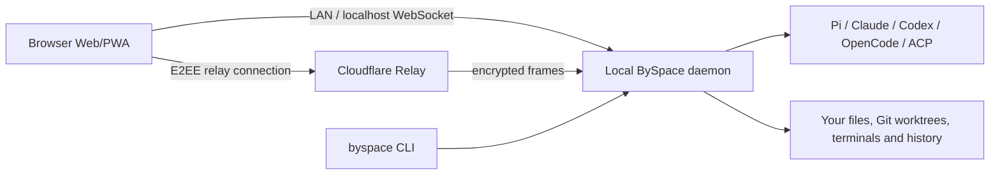

<p align="center">
  
</p>

<h1 align="center">BySpace</h1>

<p align="center">
  <a href="README.md">English</a> ·
  <a href="README.zh-CN.md">简体中文</a> ·
  <a href="README.ja.md">日本語</a>
</p>

<p align="center">
  <a href="https://github.com/ByteTrue/byspace/stargazers">
    
  </a>
  <a href="https://github.com/ByteTrue/byspace/releases">
    
  </a>
</p>

<p align="center">One interface for Claude Code, Codex, Copilot, OpenCode, and Pi agents.</p>

---

Run agents in parallel on your own machines from a hosted Web interface or the CLI.

- **Self-hosted:** Agents run on your machine with your full dev environment. Use your tools, your configs, and your skills.
- **Multi-provider:** Claude Code, Codex, Copilot, OpenCode, and Pi through the same interface. Pick the right model for each job.
- **Voice control:** Dictate tasks or talk through problems in voice mode. Hands-free when you need it.
- **Web + CLI:** Use the hosted browser interface from any device, or script the same local daemon from the terminal.
- **Privacy-first:** BySpace doesn't have any telemetry, tracking, or forced log-ins.

## Why BySpace

BySpace keeps the mature daemon, relay, protocol, and provider integrations from its upstream while narrowing the product around a browser-first workflow:

- **Pi-first:** Pi is the primary integration and the first place BySpace invests in orchestration, local commands, recovery, and subagent UX.
- **Web-only UI:** The supported graphical client is the responsive browser Web/PWA. There is no Electron shell or native iOS/Android release surface.
- **Local-first execution:** Source code, credentials, agent processes, terminals, worktrees, and history stay on the daemon machine.
- **Broad provider compatibility:** Direct provider adapters and ACP/custom providers remain available even though Pi is the first-class focus.

## How it works



The hosted Web app contains no project data. Pairing gives it the daemon identity and encrypted relay endpoint; the relay forwards encrypted WebSocket frames and cannot read agent traffic. On the same machine or LAN, the Web app can connect directly instead.

## Providers

| Provider family                 | Integration         | Notes                                                                   |
| ------------------------------- | ------------------- | ----------------------------------------------------------------------- |
| Pi                              | Pi RPC runtime      | First-class BySpace focus, including subagents and local slash commands |
| Claude Code                     | Anthropic Agent SDK | Session resume, permissions, models, tools, and native subagents        |
| Codex                           | Codex app server    | Threads, approvals, tool events, and native subagents                   |
| OpenCode                        | OpenCode SDK/server | Sessions, models, permissions, tools, and recovery                      |
| GitHub Copilot and other agents | ACP                 | Shared ACP lifecycle with catalog and custom-provider support           |

Provider CLIs still own their credentials. BySpace discovers and launches the binaries already installed on the daemon machine.

## Getting Started

BySpace runs a local daemon that manages your coding agents. The hosted Web app and CLI connect directly or through the E2EE relay.

### Prerequisites

You need at least one agent CLI installed and configured with your credentials:

- [Claude Code](https://docs.anthropic.com/en/docs/claude-code)
- [Codex](https://github.com/openai/codex)
- [GitHub Copilot](https://github.com/features/copilot/cli/)
- [OpenCode](https://github.com/anomalyco/opencode)
- [Pi](https://pi.dev)

### CLI / headless

Install the CLI and start BySpace:

```bash
npm install -g @bytetrue/byspace
byspace
```

The daemon prints a pairing link for the hosted Web app and keeps agents running after the browser closes.

### Pair the Web app

1. Keep the local daemon running; agents continue when the browser closes.
2. Open the pairing URL printed by `byspace`, or run `byspace daemon pair` to print it again.
3. The link opens [byspace.pages.dev](https://byspace.pages.dev) and stores the host in that browser profile.

Direct connections use port `6777`. Away from the daemon machine, the same pairing uses BySpace's encrypted Cloudflare Relay automatically.

For full setup and configuration, see:

- [Docs](https://byspace.pages.dev/docs)
- [Configuration reference](https://byspace.pages.dev/docs/configuration)

### Docker

Run the BySpace daemon and self-hosted web UI in Docker:

```bash
docker run -d --name byspace \
  -p 6777:6777 \
  -e BYSPACE_PASSWORD=change-me \
  -v "$PWD/byspace-home:/home/byspace" \
  -v "$PWD:/workspace" \
  ghcr.io/bytetrue/byspace:latest
```

Open `http://localhost:6777` after it starts. Extend the base image with the agent CLIs you use, then provide credentials through environment variables or the persistent `/home/byspace` volume. See the [Docker documentation](docs/docker.md) for full setup details.

## CLI

Everything you can do in the app, you can do from the terminal.

```bash
byspace run --provider claude/opus-4.6 "implement user authentication"
byspace run --provider codex/gpt-5.4 --worktree feature-x "implement feature X"

byspace ls                           # list running agents
byspace attach abc123                # stream live output
byspace send abc123 "also add tests" # follow-up task

# run on a remote daemon
byspace --host workstation.local:6777 run "run the full test suite"
```

See the [full CLI reference](https://byspace.pages.dev/docs/cli) for more.

## Skills

Skills teach your agent to use BySpace to orchestrate other agents.

```bash
npx skills add ByteTrue/byspace
```

Then use them in any agent conversation:

- `/byspace-handoff` — hand off work between agents. I use this to plan with Claude and then handoff to Codex to implement.
- `/byspace-loop` — loop an agent against clear acceptance criteria (aka Ralph loops), optionally with a verifier.
- `/byspace-advisor` — spin up a single agent as an advisor for a second opinion, without delegating the work itself.
- `/byspace-committee` — form a committee of two contrasting agents to step back, do root cause analysis, and produce a plan.

## State, configuration, and migration

BySpace stores daemon state under `$BYSPACE_HOME`, which defaults to `~/.byspace`:

- `config.json` — daemon, relay, provider, speech, and logging settings
- `server-id` and `daemon-keypair.json` — stable daemon and E2EE relay identity
- `agents/` — agent records and resumable session metadata
- `projects/` — project and workspace registry
- `schedules/`, `loops/`, and other durable runtime records

The old upstream home directory is never modified automatically. Existing users should stop the old daemon and migrate durable state with a backup rather than copying PID files, logs, or stale runtime records. See [Migrating existing state](public-docs/migrating-existing-state.md).

## Product boundary

BySpace intentionally ships the Web/PWA, CLI/daemon, encrypted relay, and complete provider layer. It does **not** ship Electron, native iOS/Android clients, the old in-app Browser automation surface, or a separate marketing website. Responsive narrow-browser layouts are still fully supported.

## Development

Quick monorepo package map:

- `packages/server`: BySpace daemon (agent process orchestration, WebSocket API, MCP server)
- `packages/app`: Expo/React Native Web client
- `packages/cli`: `byspace` CLI for daemon and agent workflows
- `packages/relay`: Relay package for remote connectivity

Common commands:

```bash
# run all local dev services
npm run dev

# run individual surfaces
npm run dev:server
npm run dev:app

# build the server stack
npm run build:server

# repo-wide checks
npm run typecheck
```

---

<p align="center">
  <a href="https://star-history.com/#ByteTrue/byspace&Date">
    <picture>
      <source media="(prefers-color-scheme: dark)" srcset="https://api.star-history.com/svg?repos=ByteTrue/byspace&type=Date&theme=dark">
      <source media="(prefers-color-scheme: light)" srcset="https://api.star-history.com/svg?repos=ByteTrue/byspace&type=Date">
      
    </picture>
  </a>
</p>

## License

AGPL-3.0

BySpace is forked from [Paseo](https://github.com/getpaseo/paseo).
