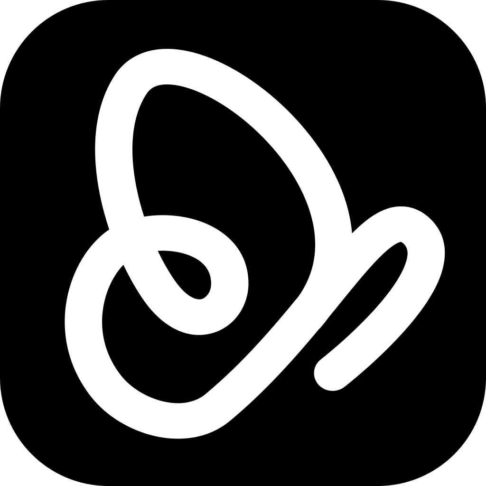

<p align="center">
  
</p>

<h1 align="center">Paseo</h1>

<p align="center">
  <a href="README.md">English</a> ·
  <a href="README.zh-CN.md">简体中文</a> ·
  <a href="README.ja.md">日本語</a>
</p>

<p align="center">
  <a href="https://github.com/getpaseo/paseo/stargazers">
    
  </a>
  <a href="https://github.com/getpaseo/paseo/releases">
    
  </a>
  <a href="https://x.com/moboudra">
    
  </a>
  <a href="https://discord.gg/jz8T2uahpH">
    
  </a>
  <a href="https://www.reddit.com/r/PaseoAI/">
    
  </a>
</p>

<p align="center">One interface for Claude Code, Codex, Copilot, OpenCode, and Pi agents.</p>

<p align="center">
  
</p>

---

Run agents in parallel on your own machines from a hosted Web interface or the CLI.

- **Self-hosted:** Agents run on your machine with your full dev environment. Use your tools, your configs, and your skills.
- **Multi-provider:** Claude Code, Codex, Copilot, OpenCode, and Pi through the same interface. Pick the right model for each job.
- **Voice control:** Dictate tasks or talk through problems in voice mode. Hands-free when you need it.
- **Web + CLI:** Use the hosted browser interface from any device, or script the same local daemon from the terminal.
- **Privacy-first:** Paseo doesn't have any telemetry, tracking, or forced log-ins.

## Getting Started

Paseo runs a local daemon that manages your coding agents. The hosted Web app and CLI connect directly or through the E2EE relay.

### Prerequisites

You need at least one agent CLI installed and configured with your credentials:

- [Claude Code](https://docs.anthropic.com/en/docs/claude-code)
- [Codex](https://github.com/openai/codex)
- [GitHub Copilot](https://github.com/features/copilot/cli/)
- [OpenCode](https://github.com/anomalyco/opencode)
- [Pi](https://pi.dev)

### CLI / headless

Install the CLI and start Paseo:

```bash
npm install -g @bytetrue/byspace-cli
paseo
```

The daemon prints a pairing link for the hosted Web app and keeps agents running after the browser closes.

For full setup and configuration, see:

- [Docs](https://paseo.sh/docs)
- [Configuration reference](https://paseo.sh/docs/configuration)

### Docker

Run the Paseo daemon and self-hosted web UI in Docker:

```bash
docker run -d --name paseo \
  -p 6767:6767 \
  -e PASEO_PASSWORD=change-me \
  -v "$PWD/paseo-home:/home/paseo" \
  -v "$PWD:/workspace" \
  ghcr.io/getpaseo/paseo:latest
```

Open `http://localhost:6767` after it starts. Extend the base image with the agent CLIs you use, then provide credentials through environment variables or the persistent `/home/paseo` volume. See the [Docker documentation](docs/docker.md) for full setup details.

## CLI

Everything you can do in the app, you can do from the terminal.

```bash
paseo run --provider claude/opus-4.6 "implement user authentication"
paseo run --provider codex/gpt-5.4 --worktree feature-x "implement feature X"

paseo ls                           # list running agents
paseo attach abc123                # stream live output
paseo send abc123 "also add tests" # follow-up task

# run on a remote daemon
paseo --host workstation.local:6767 run "run the full test suite"
```

See the [full CLI reference](https://paseo.sh/docs/cli) for more.

## Skills

Skills teach your agent to use Paseo to orchestrate other agents.

```bash
npx skills add getpaseo/paseo
```

Then use them in any agent conversation:

- `/paseo-handoff` — hand off work between agents. I use this to plan with Claude and then handoff to Codex to implement.
- `/paseo-loop` — loop an agent against clear acceptance criteria (aka Ralph loops), optionally with a verifier.
- `/paseo-advisor` — spin up a single agent as an advisor for a second opinion, without delegating the work itself.
- `/paseo-committee` — form a committee of two contrasting agents to step back, do root cause analysis, and produce a plan.

## Development

Quick monorepo package map:

- `packages/server`: Paseo daemon (agent process orchestration, WebSocket API, MCP server)
- `packages/app`: Expo/React Native Web client
- `packages/cli`: `paseo` CLI for daemon and agent workflows
- `packages/relay`: Relay package for remote connectivity

Common commands:

```bash
# run all local dev services
npm run dev

# run individual surfaces
npm run dev:server
npm run dev:app

# build the server stack
npm run build:server

# repo-wide checks
npm run typecheck
```

## Community

- [paseo-relay](https://github.com/zenghongtu/paseo-relay) — self-hosted relay in Go
- [paseo-vscode](https://marketplace.visualstudio.com/items?itemName=hinnes.paseo-vscode) — VS Code extension

---

<p align="center">
  <a href="https://star-history.com/#getpaseo/paseo&Date">
    <picture>
      <source media="(prefers-color-scheme: dark)" srcset="https://api.star-history.com/svg?repos=getpaseo/paseo&type=Date&theme=dark">
      <source media="(prefers-color-scheme: light)" srcset="https://api.star-history.com/svg?repos=getpaseo/paseo&type=Date">
      
    </picture>
  </a>
</p>

## License

AGPL-3.0
