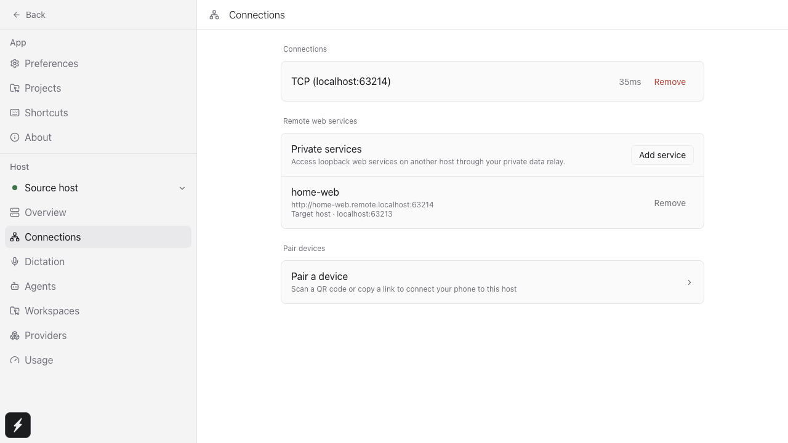
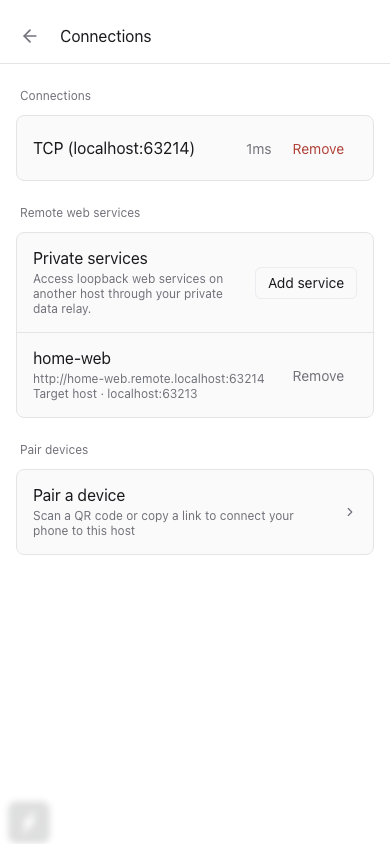

# Private Remote Web Services

Private Remote Web Services let one BySpace daemon access an HTTP, SSE, or WebSocket service bound to loopback on another daemon. They are intended for development services such as AI gateways, Vite/Next.js preview servers, and HMR connections.

They do not create public service URLs and do not provide a general-purpose TCP tunnel.

## Architecture

Remote Web Services split control traffic from service data:

- The existing hosted E2EE Relay remains the control plane for the Web app, workspaces, and Agents.
- A daemon-hosted Data Relay carries only encrypted Remote Web Service traffic.
- Every participating daemon makes an outbound WebSocket connection to the Data Relay.
- The Data Relay pairs sockets and forwards ciphertext in memory. It cannot read HTTP headers, bodies, SSE events, or WebSocket messages.
- A static access token prevents unauthorized clients from consuming relay bandwidth. It does not authorize loopback access.
- Daemon public keys authenticate and encrypt the end-to-end channel. The target also requires an exact persisted grant for the source daemon public key, mapping ID, and loopback port.

The Data Relay runs as an optional listener inside the normal BySpace daemon. It uses a separate port and exposes only `GET /health` and WebSocket upgrades at `/ws`. Never publish the daemon's main port (`6777`) as the Data Relay.

## Primary topology: enterprise computer and home development computer

Assume:

- **A — enterprise computer:** browser, AI gateway at `127.0.0.1:8317`, and daemon A. It can make outbound WSS connections but cannot host a tunnel.
- **B — home development computer:** projects, Agents, Web development server at `127.0.0.1:5173`, and daemon B. It can run an inbound tunnel.

B hosts the Data Relay:

```text
Enterprise A daemon ── outbound WSS 443 ──┐
                                          │
                               B's tunnel endpoint
                                          │
                               B Data Relay :8788
                                          │ local WS
Home B daemon ─────────────────────────────┘
```

The same relay supports both directions:

```text
B Agent → office-ai.remote.localhost → A:127.0.0.1:8317
A browser → home-web.remote.localhost → B:127.0.0.1:5173
```

Only B's Data Relay listener is exposed through the tunnel. Do not expose ports `6777`, `5173`, or `8317`.

### 1. Generate one access token

Use the same token on the relay host and every participating daemon:

```bash
openssl rand -base64 32
```

Treat it as a secret. It authorizes use of the Data Relay but does not replace daemon-to-daemon E2EE identity verification.

### 2. Configure daemon B

B both hosts the relay and connects to it locally:

```bash
export BYSPACE_DATA_RELAY_LISTEN=127.0.0.1:8788
export BYSPACE_DATA_RELAY_ENDPOINT=127.0.0.1:8788
export BYSPACE_DATA_RELAY_USE_TLS=false
export BYSPACE_DATA_RELAY_PUBLIC_ENDPOINT=relay-home.example.com:443
export BYSPACE_DATA_RELAY_PUBLIC_USE_TLS=true
export BYSPACE_DATA_RELAY_ACCESS_TOKEN='<shared-secret>'

byspace daemon start
```

Configure the tunnel to forward its public HTTPS/WSS hostname to `http://127.0.0.1:8788`. WebSocket upgrade support must be enabled. The public health check is:

```text
https://relay-home.example.com/health
```

### 3. Configure daemon A

A connects through B's public tunnel:

```bash
export BYSPACE_DATA_RELAY_ENDPOINT=relay-home.example.com:443
export BYSPACE_DATA_RELAY_USE_TLS=true
export BYSPACE_DATA_RELAY_ACCESS_TOKEN='<shared-secret>'

byspace daemon start
```

Both daemons must also remain connected through the ordinary BySpace control plane so the Web app can manage their mappings.

### 4. Create mappings

In each source host's settings, create the address needed on that host:

| Source host | Mapping name | Target         | Resulting local address                             |
| ----------- | ------------ | -------------- | --------------------------------------------------- |
| B           | `office-ai`  | A, port `8317` | `http://office-ai.remote.localhost:<B daemon port>` |
| A           | `home-web`   | B, port `5173` | `http://home-web.remote.localhost:<A daemon port>`  |

Mappings persist on the source daemon. Creating one also writes an authorization grant on the target daemon for the source daemon public key, mapping ID, and loopback port. The source mapping is the authorization desired state: whenever the management UI loads it while both daemons are online, the Web app idempotently repairs the exact target grant, including after an indeterminate create response or target reconnect. Removing the mapping revokes that target grant before deleting the source route. Neither record stores the Data Relay endpoint or access token.

## User interface

Remote Web Services are managed from **Host settings → Connections**.

### Desktop browser



### Compact browser viewport



## Moving the relay to a VPS

Moving from B-hosted relay to a VPS does not require recreating mappings or changing AI gateway and Web preview URLs.

### 1. Install and run BySpace on the VPS

Install the same BySpace package used by A and B:

```bash
npm install -g @bytetrue/byspace@latest
```

The VPS daemon only needs to host the isolated Data Relay listener:

```bash
export BYSPACE_DATA_RELAY_LISTEN=127.0.0.1:8788
export BYSPACE_DATA_RELAY_PUBLIC_ENDPOINT=relay.example.com:443
export BYSPACE_DATA_RELAY_PUBLIC_USE_TLS=true
export BYSPACE_DATA_RELAY_ACCESS_TOKEN='<shared-secret>'

byspace daemon start --listen 127.0.0.1:6777 --no-web-ui
```

For production, put these variables in the VPS service manager's protected environment file and run `byspace daemon start --foreground`. The full daemon port `6777` must remain loopback-only.

### 2. Reverse proxy only the Data Relay

Example Caddy configuration:

```caddy
relay.example.com {
    reverse_proxy 127.0.0.1:8788
}
```

Caddy terminates TLS and forwards WebSocket upgrades. Do not proxy `127.0.0.1:6777`.

### 3. Point A and B at the VPS

Change only these values on A and B, then restart their daemons:

```bash
export BYSPACE_DATA_RELAY_ENDPOINT=relay.example.com:443
export BYSPACE_DATA_RELAY_USE_TLS=true
export BYSPACE_DATA_RELAY_ACCESS_TOKEN='<shared-secret>'
```

The existing mappings and `.remote.localhost` addresses remain unchanged because relay location is runtime configuration rather than persisted mapping data.

## Configuration reference

| Variable                             | Used by              | Meaning                                                                      |
| ------------------------------------ | -------------------- | ---------------------------------------------------------------------------- |
| `BYSPACE_DATA_RELAY_LISTEN`          | Relay host           | Dedicated local listener, normally `127.0.0.1:8788`                          |
| `BYSPACE_DATA_RELAY_ENDPOINT`        | Participating daemon | Relay `host:port` without a URL scheme or path; `/ws` is added automatically |
| `BYSPACE_DATA_RELAY_USE_TLS`         | Participating daemon | `true` for WSS, `false` for a local WS connection                            |
| `BYSPACE_DATA_RELAY_PUBLIC_ENDPOINT` | Relay host           | Public `host:port` recorded in diagnostics and deployment configuration      |
| `BYSPACE_DATA_RELAY_PUBLIC_USE_TLS`  | Relay host           | Whether the public endpoint uses WSS                                         |
| `BYSPACE_DATA_RELAY_ACCESS_TOKEN`    | Both                 | Shared bearer token required for hosting or connecting                       |

The daemon reads these variables at startup, and each request uses that running configuration. Changing the endpoint or token requires restarting A and B, but never modifies or recreates stored mappings.

## Failure behavior

A broken relay connection ends current work immediately:

- HTTP and SSE requests fail;
- WebSocket and HMR connections close;
- the target cancels the corresponding loopback request;
- daemons reconnect automatically;
- the next request uses the existing mapping and current relay configuration.

Remote Web Services do not replay requests, resume SSE streams, or cache responses.

## Security boundary

- Bind the Data Relay listener to loopback when a local reverse proxy or tunnel publishes it.
- Publish only the Data Relay port, never the daemon API or target service ports.
- Use TLS for every non-loopback endpoint.
- Source-side `*.remote.localhost` routes accept only raw loopback TCP clients; forwarded headers cannot bypass this boundary.
- Target-side grants bind each mapping ID and port to the source daemon's long-term E2EE public key. Revocation blocks new connections; an already active HTTP/SSE/WebSocket stream ends normally or when either side disconnects.
- The target issues a fresh per-connection challenge before accepting `remote.web.open`; a captured open cannot be replayed after reconnect or daemon restart. Every data frame is then bound to the negotiated session and a monotonic sequence number, so repeated or cross-connection frames close the stream before reaching loopback.
- Store the access token in a mode-`0600` environment/secret file, keep it out of shell history and service command lines, and rotate it if exposed. The shared token remains an availability trust domain: a malicious holder can consume bounded Relay session/socket capacity, but cannot pass target loopback authorization.
- Keep the daemon and reverse proxy updated.
- Prefer a dedicated VPS daemon with no projects or provider credentials when hosting a central relay.
